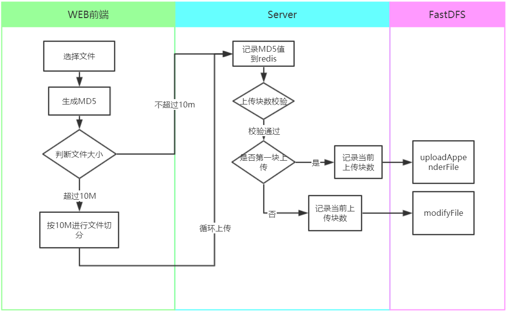

---

---

# FAST DFS

本次使用fastdfs-5.12 版本

## 1、分布式文件系统背景

### 1.1 应用场景

**非机构化数据的存储要求**

- 电商网站：海量商品图片
- 视频网站：海量视频文件

- 网盘 : 海量文件
- 社交网站：海量图片

### 1.2 各分布式文件系统差异性比较

#### 1.2.1 GFS  （Google File System） 	

 一 个GFS集群由一个master和大量的chunkserver构成，并被许多客户（Client）访问。 

  

 master 存储了三种类型的metadata：文件的名字空间和块的名字空间，从文件到块的映射，块的副本的位置。所有的metadata都放在内存中。

#### 1.2.2 HDFS （ Hadoop  Distributed File System ）

 HDFS采用了主从（Master/Slave）结构模型，一个HDFS集群是由一个NameNode和若干个DataNode组成的。其中NameNode作为主服务器，管理文件系统的命名空间和客户端对文件的访问操作；集群中的DataNode管理存储的数据。 

  


### 1.3 对象存储云服务

**阿里云oss**


**百度云bos**


**腾讯云cos**


## 2、FastDFS 介绍

 FastDFS 是一个C 语言实现的开源轻量级分布式文件系统,作者余庆.

**仅支持 Linux、FreeBSD、AID 等 Unix 系统**

解决了大数据存储和读写负载均衡等问题,适合存储 4KB~500MB 之间的小文件,如图片网站、短视频网站、文档、app 下载站等,UC、京东、支付宝、迅雷、酷狗等都有使用,其中 UC 基于 FastDFS 向用户提供网盘、广告和应用下载的业务的存储服务 FastDFS 与 MogileFS、HDFS、TFS 等都不是系统级的分布式文件系统,而是应用级的分布式文件存储服务。

## 3、FastDFS 架构

 FastDFS服务有两个角色:跟踪服务器(tracker server)、存储服务器(storage server)


### 3.1跟踪服务器(tracker server)

跟踪服务器,主要做调度工作,起到均衡的作用;负责管理所有的 storage server 和 group,每个 storage 在启动后会连接 Tracker,告知自己所属 group 等信息,并保持周期性心跳, Tracker根据storage心跳信息,建立group--->[storage server list]的映射表;tracker管理的元数据很少,会直接存放在内存;tracker 上的元信息都是由 storage 汇报的信息生成的,本身不需要持久化任何数据,tracker 之间是对等关系,因此扩展 tracker 服务非常容易,之间增加 tracker服务器即可,所有tracker都接受stroage心跳信息,生成元数据信息来提供读写服务(与 其他 Master-Slave 架构的优势是没有单点,tracker 也不会成为瓶颈,最终数据是和一个可用的 Storage Server进行传输的)   

### 3.2存储服务器(storage server)

存储服务器,主要提供容量和备份服务;以 group 为单位,每个 group 内可以包含多台storage server,数据互为备份,存储容量空间**以group内容量最小的storage为准**;建 议group内的storage server配置相同;以group为单位组织存储能够方便的进行应用隔离、负载均衡和副本数定制;缺点是 group 的容量受单机存储容量的限制,同时 group 内机器坏掉,数据 恢复只能依赖 group 内其他机器重新同步(坏盘替换,重新挂载重启 fdfs_storaged 即可)

### 3.4 网络模型

Tracker server之间相互独立，不存在直接联系。

Storage server主动连接Tracker server。Storage server主动向Tracker server报告其状态信息，包括

- 磁盘剩余空间
- 文件同步状况
- 文件上传下载次数

Storage server会连接集群中所有的Tracker server，向他们报告自己的状态。Storage server启动一个单独的线程来完成对一台Tracker server的连接和定时报告。

需要说明的是，一个组包含的Storage server不是通过配置文件设定的，而是通过Tracker server获取到的。

不同组的Storage server之间不会相互通信，同组内的Storage server之间会相互连接进行文件同步。

### 3.5 功能说明

 FastDFS向使用者提供基本文件访问接口，比如

- upload 上传
- download 下载
- **append**  拼接
- delete 删除

以客户端库的方式提供给用户使用。

#### 3.5.1 上传图片


**选择tracker server**

当集群中不止一个tracker server时，由于tracker之间是完全对等的关系，客户端在upload文件时可以任意选择一个trakcer。**可以自行轮询访问**。

**选择group**

当tracker接收到upload file的请求时，会为该文件分配一个可以存储该文件的***\*group\****，支持如下选择***\*group\****的规则：

1. Round robin，所有的group间轮询

2. Specified group，指定某一个确定的group

3. Load balance，剩余存储空间多的group优先

   见 tracker.conf文件

   ```
   # the method of selecting group to upload files
   # 0: round robin
   # 1: specify group
   # 2: load balance, select the max free space group to upload file
   store_lookup=2
   ```

**选择storage server**

当选定group后，tracker会在group内选择一个storage server给客户端，支持如下选择storage的规则：

1. Round robin，在group内的所有storage间轮询

2. First server ordered by ip，按ip排序

3. First server ordered by priority，按优先级排序（优先级在storage上配置）

   见 tracker.conf文件

   ```
   # which storage server to upload file
   # 0: round robin (default)
   # 1: the first server order by ip address
   # 2: the first server order by priority (the minimal)
   # Note: if use_trunk_file set to true, must set store_server to 1 or 2
   store_server=0
   ```

**选择storage path**

当分配好storage server后，客户端将向storage发送写文件请求，storage将会为文件分配一个数据存储目录，支持如下规则：

1. Round robin，多个存储目录间轮询

2. 剩余存储空间最多的优先

   见 tracker.conf文件

   ```
   # which path(means disk or mount point) of the storage server to upload file
   # 0: round robin
   # 2: load balance, select the max free space path to upload file
   store_path=0
   ```

**生成Fileid**

选定存储目录之后，storage会为文件生一个Fileid，由storage server ip、文件创建时间、文件大小、文件crc32和一个随机数拼接而成，然后将这个二进制串进行base64编码，转换为可打印的字符串。

`rBAABF3eZfGAZcEyAAAA2L1oJqs229`

**选择两级目录**

当选定存储目录之后，storage会为文件分配一个fileid，每个存储目录下有两级256*256的子目录，storage路由到其中一个子目录，然后将文件以fileid为文件名存储到该子目录下。

`/00/00`

**生成文件名**

当文件存储到某个子目录后，即认为该文件存储成功，接下来会为该文件生成一个文件名，文件名由***\*group\****、存储目录、两级子目录、fileid、文件后缀名（由客户端指定，主要用于区分文件类型）拼接而成。

`/group1/M00/00/00/rBAABF3eZfGAZcEyAAAA2L1oJqs229.jpg`

#### 3.5.2 文件下载

客户端upload file成功后，会拿到一个storage生成的文件名，接下来客户端根据这个文件名即可访问到该文件。


跟upload file一样，在download file时客户端可以选择任意tracker server。

tracker发送download请求给某个tracker，必须带上文件名信息，tracke从文件名中解析出文件的group、大小、创建时间等信息，然后为该请求选择一个storage用来服务读请求。由于group内的文件同步时在后台异步进行的，所以有可能出现在读到时候，文件还没有同步到某些storage server上，为了尽量避免访问到这样的storage，tracker按照如下规则选择group内可读的storage

```
1. 该文件上传到的源头storage

  - 源头storage只要存活着，肯定包含这个文件，源头的地址被编码在文件名中。

2. 文件创建时间戳==storage被同步到的时间戳 且(当前时间-文件创建时间戳) > 文件同步最大时间（如5分钟)

  - 文件创建后，认为经过最大同步时间后，肯定已经同步到其他storage了。

3. 文件创建时间戳 < storage被同步到的时间戳。

  - 同步时间戳之前的文件确定已经同步了 

4. (当前时间-文件创建时间戳) > 同步延迟阀值（如一天）。

  - 经过同步延迟阈值时间，认为文件肯定已经同步了。
```

Storage上的Nginx Module首先会去看本机有没有被请求的文件，如果没有的话，会从FileId中解开源Storage的IP地址，然后去访问，如果此时源Storage当机了，那么本次下载请求就此失败（Nginx Module从始至终没有拿着被请求文件的Group Name去问Tracker现在哪台活着的Storage能响应请求）

#### 3.5.3 文件删除

删除处理流程与文件下载类似：

1. Client询问Tracker server可以下载指定文件的Storage server，参数为文件ID（包含组名和文件名）；

2. Tracker server返回一台可用的Storage server；

3. Client直接和该Storage server建立连接，完成文件删除。

#### 3.5.4 文件同步

写文件时，客户端将文件写至group内一个storage server即认为写文件成功，storage server写完文件后，会由后台线程将文件同步至同group内其他的storage server。

Storage server采用binlog文件记录文件上传、删除等更新操作。binlog中只记录文件名，不记录文件内容。

文件同步只在同组内的Storage server之间进行，采用push方式，即源头服务器同步给目标服务器。只有源头数据才需要同步，备份数据并不需要再次同步，否则就构成环路了。有个例外，就是新增加一台Storage server时，由已有的一台Storage server将已有的所有数据（包括源头数据和备份数据）同步给该新增服务器。

Storage server中由专门的线程根据binlog进行文件同步。为了最大程度地避免相互影响以及出于系统简洁性考虑，Storage server对组内除自己以外的每台服务器都会启动一个线程来进行文件同步。

storage的同步进度会作为元数据的一部分汇报到tracker上，tracke在选择读storage的时候会以同步进度作为参考。

比如一个group内有A、B、C三个storage server，A向C同步到进度为T1 (T1以前写的文件都已经同步到B上了），B向C同步到时间戳为T2（T2 > T1)，tracker接收到这些同步进度信息时，就会进行整理，将最小的那个做为C的同步时间戳，本例中T1即为C的同步时间戳为T1（即所有T1以前写的数据都已经同步到C上了）；同理，根据上述规则，tracker会为A、B生成一个同步时间戳。

文件同步采用增量同步方式，系统记录已同步的位置（binlog文件偏移量）到标识文件中。标识文件名格式：{dest storage IP}_{port}.mark，例如：192.168.1.14_23000.mark

#### 3.5.5 断点续传

提供appender file的支持，通过upload_appender_file接口存储，appender file允许在创建后，对该文件进行append操作。实际上，appender file与普通文件的存储方式是相同的，不同的是，appender file不能被合并存储到trunk file。.续传涉及到的文件大小MD5不会改变。续传流程与文件上传类是，先定位到源storage，完成完整或部分上传，再通过binlog进行同group内server文件同步。

#### 3.5.6 文件属性

FastDFS提供了设置/获取文件扩展属性的接口（setmeta/getmeta)，扩展属性以key-value对的方式存储在storage上的同名文件（拥有特殊的前缀或后缀），比如/group/M00/00/01/some_file为原始文件，则该文件的扩展属性存储在/group/M00/00/01/.some_file.meta文件（真实情况不一定是这样，但机制类似），这样根据文件名就能定位到存储扩展属性的文件。

以上两个接口作者不建议使用，额外的meta文件会进一步“放大”海量小文件存储问题，同时由于meta非常小，其存储空间利用率也不高，比如100bytes的meta文件也需要占用4K（block_size）的存储空间。

#### 3.5.7 HTTP访问的问题

FastDFS 4.05前在tracker和storage都内置了http协议的支持，客户端可以通过http协议来下载文件，tracker在接收到请求时，通过http的redirect机制将请求重定向至文件所在的storage上，但是FastDFS的HTTP服务较为简单，无法提供负载均衡等高性能的服务，所以FastDFS的作者为我们提供了Nginx上使用的FastDFS模块（也可以叫FastDFS的Nginx模块）。 

 * ```
    Version 4.05  2012-12-30
    
   * client/fdfs_upload_file.c can specify storage ip port and store path index
   * add connection pool
   * client load storage ids config
   * common/ini_file_reader.c does NOT call chdir
   * keep the mtime of file same
   * use g_current_time instead of call time function
   * remove embed HTTP support
   ```


所以fastDfs的http访问必须通过nginx搭配使用。

## 4、 FastDFS 安装部署

### 4.1、安装 libfastcommon依赖库

资料中已提供

上传到某个目录，这里我使用的/tmp/目录,解压,进入解压目录

`cd /tmp/libfastcommon-master`


执行 `./make.sh` 编译libfastcommon-master`

编译成功后 安装`./make.sh install`

64位系统会安装在/usr/lib64 目录。32位操作系统会安装在/usr/lib中


### 4.2 配置环境变量和软链接

```bash
export LD_LIBRARY_PATH=/usr/lib64/

ln -s /usr/lib64/libfastcommon.so /usr/local/lib/libfastcommon.so
```

### 4.3 下载fastDfs

放至某目录，并解压

```css
tar -zxvf fastdfs-5.12.tar.gz 
```

解压后进入目录编译安装

```go
./make.sh
./make.sh install
```

安装完成之后默认安装在`/etc/fdfs/`中，并会生成这四个示例文件：

```
 tracker.conf.sample
 client.conf.sample
 storage.conf.sample
 storage_ids.conf.sample
```

给文件赋权限，修改文件名，直接修改或者备份后修改。

改名：

```css
chmod 777 tracker.conf.sample
mv tracker.conf.sample tracker.conf
chmod 777 client.conf.sample
mv client.conf.sample client.conf
chmod 777 storage.conf.sample
mv storage.conf.sample storage.conf
chmod 777 storage_ids.conf.sample
mv storage_ids.conf.sample storage_ids.conf
```

or 复制：

```undefined
sudo cp /etc/fdfs/tracker.conf.sample /etc/fdfs/tracker.conf
sudo cp /etc/fdfs/client.conf.sample /etc/fdfs/client.conf
sudo cp /etc/fdfs/storage.conf.sample /etc/fdfs/storage.conf
sudo cp /etc/fdfs/storage_ids.conf.sample /etc/fdfs/storage_ids.conf
```

### 4.4 配置跟踪服务器的tracker的配置文件

 首先建立一个文件夹 tracker,这个文件夹我建立在`/home/software/fastdfs/tracker`中 

 然后编辑`tracker.conf`这个配置文件 

```undefined
mkdir –p /home/software/fastdfs/tracker
```

```ruby
# the base path to store data and log files
base_path=/home/software/fastdfs/tracker

# the tracker server port
port=22122
```

### 4.5 配置存储服务器storage 的配置文件

首先建立一个文件夹storage ，这个文件夹我建立在`/home/software/fastdfs/tracker/storage `

```
mkdir –p /home/software/fastdfs/storage
```

编辑 storage.conf 文件 ,193.112.53.149为tracker服务器地址

```ruby
group_name=group1
store_path0=/home/software/fastdfs/storage
base_path=/home/software/fastdfs/storage
tracker_server=193.112.53.149:22122
```

### 4.6  修改client.conf

```ruby
base_path=/home/software/fastdfs/tracker
tracker_server=193.112.53.149:22122
```

### 4.7 启动服务

```ruby
/usr/bin/fdfs_trackerd /etc/fdfs/tracker.conf
/usr/bin/fdfs_storaged /etc/fdfs/storage.conf

ps aux|grep tracker
ps aux|grep storage
```

如果启动成功会显示


 检查storage是否注册到了tracker中去 

```
/usr/bin/fdfs_monitor /etc/fdfs/storage.conf
```


### 4.8 上传测试

上传 /home/ant/pic/psb.jpg这张图片到fastDfs服务中

```
fdfs_test /etc/fdfs/client.conf upload /home/software/fastdfs/test/test.jpg
```


### 4.9 关闭fadtDFS

```undefined
killall fdfs_trackerd 
killall fdfs_storaged 
```

### 4.10 重启fastDFS

进入fastdfs安装包解压目录

```
cd /tmp/fastdfs-5.12/

restart.sh /usr/bin/fdfs_trackerd /etc/fdfs/tracker.conf
restart.sh /usr/bin/fdfs_storaged /etc/fdfs/storage.conf
```

### 4.11 nginx配置

 nginx安装之前一定要确定是否已经安装了必备的依赖库 

 **zlib、pcre、openssl** 

gzip 模块需要 zlib 库
rewrite 模块需要 pcre 库
ssl 功能需要openssl库 

复习资料中提供了3个库的安装包，放至某一目录解压、编译、安装即可

#### 4.11.1 zlib安装

```go
tar -xvf zlib-1.2.11.tar
cd 对应解压目录
./configure
make
make install
```

#### 4.11.2 pcre 安装

```go
tar -zxvf pcre-8.42.tar.gz
cd 对应解压目录
./configure
make
make install
```

./configure 如果出现以下错误


先安装c++ 编译器 

```
 yum -y install gcc-c++ 
```

然后执行编译、安装。

#### 4.11.3 openssl

```go
unzip openssl-OpenSSL_1_1_1-stable.zip
cd 对应解压目录
./config
make
make install
```

#### 4.11.4 安装nginx + fastdfs-nginx-moudule-master

下载  fastdfs-nginx-module

下载nginx

资料中已提供.

fastdfs-nginx-module有好几个版本，这里需要注意和nginx的兼容性。

##### 4.11.4.1  fastdfs-nginx-module

解压 fastdfs-nginx-module-1.20.zip

进入解压目录中的src目录

复制mod_fastdfs.conf 到 /etc/fdfs/ 下


```bash
cp mod_fastdfs.conf /etc/fdfs/mod_fastdfs.conf
cd /etc/fdfs
```

修改该文件

```
vim /etc/fdfs/mod_fastdfs.conf
```

修改内容如下

```bash
connect_timeout=10
# the base path to store log files 
base_path=/home/software/fastdfs/log
# FastDFS tracker_server 
tracker_server=193.112.53.149:22122 
# store_path#, based 0, if store_path0 not exists, it's value is base_path 
# the paths must be exist 
# must same as storage.conf 
store_path0=/home/software/fastdfs/storage
# if the url / uri including the group name 
url_have_group_name = true 
```

##### 4.11.4.2 复制http.conf、mime.types到 /etc/fdfs目录  （重要）	

这两个文件在fastdfs安装包解压目录中

```
cd /tmp/fastdfs-5.12/conf
cp http.conf /etc/fdfs/http.conf
cp mime.types /etc/fdfs/mime.types
```

注意删除 mod_fastdfs.conf中的#include http.conf  前面的#号，“ #include http.conf ”整体为一个命令

原始文件

```
##include http.conf
```

##### 4.11.4.3 安装nginx

解压后进入nginx解压目录


执行configure

```
./configure --prefix=/usr/local/nginx --add-module=/home/software/fastdfs-nginx-module-1.20/src
```

configure执行成功后，编译，安装

```
make
make install
```

进入nginx安装目录，修改nginx配置文件

```
cd /usr/local/nginx/conf
vim nginx.conf
```

修改如下配置

```nginx
server {
    listen       80;
    server_name  localhost;
    #charset koi8-r;

    #access_log  logs/host.access.log  main;
    
    location ~/group([0-9])/ {
        ngx_fastdfs_module;
    }
```
启动nginx

```
/usr/local/nginx/sbin/nginx
```

访问测试


##### 4.11.4.4 集群下多group和多Storage 下nginx配置


## 5、应用集成

###   5.1 普通客户端

maven依赖，网上有大量的fastdfs java客户端，有是跟余庆老师相同的客户端，也有基于原客户端扩展的客户端。

```
<dependency>
         <groupId>cn.bestwu</groupId>
        <artifactId>fastdfs-client-java</artifactId>
        <version>1.27</version>
 </dependency>
```

复制依赖包中的配置文件到resources目录

properties 和conf文件取其中一个就行，取决于你在使用客户端加载哪个文件。


修改配置

修改tracker_server地址。如果有多个tracker_server，则配置多个tracker_server=

```properties
connect_timeout = 2
network_timeout = 30
charset = UTF-8
http.tracker_http_port = 8080
http.anti_steal_token = no
http.secret_key = FastDFS1234567890

tracker_server = 193.112.53.149:22122
```

如果使用conf文件，有多个tracker_server，则配置多个tracker_server=  ，如：

```properties
connect_timeout = 2
network_timeout = 30
charset = UTF-8
http.tracker_http_port = 8080
http.anti_steal_token = no
http.secret_key = FastDFS1234567890

tracker_server = 193.112.53.149:22122
tracker_server = 193.112.53.150:22122
```

源码见学习资料

###   5.2 连接池

在上一节的客户端使用中，我们封装了自己的fastdfs文件上传类。

在文件传输过程中，fastDfs直接使用socket进行传输，如果在多线程环境下公用一个socket，数据流共享的情况下无法保证服务端对于数据流的正常解析而出现异常。

我们可是自己基于原生客户端实现连接池功能。

代码见学习资料

###   5.3 断点续传

 客户端软件断点续传指的是在下载或上传时，将下载或上传任务（一个文件或一个压缩包）人为的划分为几个部分，每一个部分采用一个线程进行上传或下载，如果碰到网络故障，可以从已经上传或下载的部分开始继续上传下载未完成的部分，而没有必要从头开始上传下载。用户可以节省时间，提高速度。 

fastdfs客户端提供appender file的支持，通过upload_appender_file以及modifyFile接口存储，appender file允许在创建后，对该文件进行append操作。实际上，appender file与普通文件的存储方式是相同的，不同的是，appender file不能被合并存储到trunk file。续传涉及到的文件大小MD5不会改变。续传流程与文件上传类是，先定位到源storage，完成完整或部分上传，再通过binlog进行同group内server文件同步。



### 5.4 重复文件秒传

5.3中介绍到根据文件流进行MD5加密可以判断文件的重复性，那我们在上传文件成功后可以将数据md5作为key，文件请求url作为value存储在我们的数据库中，上传时可根据md5从库中校验是否存在，存在则直接返回url并提示上传成功。

**补充知识点:**FastDfs自身也可以扩展该功能，

需要扩展对FastDHT (余庆老师开发的一个key-value形式的数据库) 的支持。

## 6、SEO优化 短域名实现方案

###  6.1 什么是短链接

比如说我之前有个URL如下

```
http://193.112.53.149/group1/M00/00/03/rBAABF3k-2CERnsSAAAAAElkdH4084.jpg 
```

这个URL很长，现在通过某种方式将上面的URL转义成

```
http://ym.cn/5MMEX3D
```

### 6.2 为什么需要短链接

- 节省发送的内容
- 提示用户体验
- 一定程度上保护原始链接
- 有利于SEO

### 6.3 实现方案

在上传图片成功后对url进行运算，得到一个较短的key，以原始url作为value存入redis中，通过短域名地址访问的时候请求到短域名专用nginx中，然后通过请求url去redis中查询，得到真实的url，然后重定向。我们这里使用openResty作为短域名转发服务。

lua脚本

```lua
local redis = require "resty.redis"
local cjson = require "cjson"
local cache = redis.new()
cache.connect(cache, '127.0.0.1', '6379')

local uri = ngx.var.request_uri 
uri = string.gsub(uri, "/", "") 

local res = cache:get(uri)

if res == ngx.null then
 ngx.say(uri)
 return ''
end

return ngx.redirect(res)
```

nginx脚本

```nginx
location / {
		lua_code_cache off;
		resolver 8.8.8.8;
        rewrite_by_lua_file E:\down\openresty-1.15.8.2-win64\lua\short.lua;
		root   html;
		index  index.html index.htm;
}
```

生成短链算法

## 7、运维调优

### 7.1 扩容

FDFS扩容有两种方式：一个group内增加节点存储容量或者增加group。前者通过硬盘扩容的方式实现；后者通过增加服务器方式实现。

方式一，横向扩容--硬盘扩容方式，只需对某group内的服务器，分别加硬盘即可；通过操作系统把新硬盘mount进去，在新的硬盘中，创建FDFS存储目录，如/myext-1/fdfs，然后修改stroage.conf文件，增加store_pathN= /myext-1/fdfs，其中N为当前路径数+1；最后同步配置文件到同group内的其他节点，重启stroage完成扩容工作。

方式二，纵向扩容--增加group方式，规划group内的数据节点，存储目录、配置文件等保持一致(建议整个storage cluster中的配置、规则保持一致)，修改storage.conf文件，把group_name=groupN，其中N为当前分组数+1。重启新增的group集群即可。

### 7.2 迁移

FastDFS集群整体迁移的问题。

如果新旧IP地址一一对应，而且是一样的，那非常简单，直接将data目录拷贝过去即可。

IP不一样的话，会比较麻烦一些。

如果使用了V4的自定义server ID特性，那么比较容易，直接将tracker上的IP和ID映射文件storage_ids.conf修改好即可。

如果是用IP地址作为服务器标识，那么需要修改tracker和storage的data目录下的几个数据文件，将旧IP调整为新IP。

注意storage的data目录下有一个.打头的隐藏文件也需要修改。

另外，需要将后缀为mark的IP地址和端口命名的同步位置记录文件名改名。

文件全部调整完成后才能启动集群服务。

tracker server上需要调整配置文件

storage server需要调整的文件列表：

data/.data_init_flag

data/sync/{ip_addr}_​{port}.mark：此类文件，需要将文件名中的IP地址调整过来。

### 7.3 合并存储

​           合并存储是指将多个小文件存储到一个较大的文件（trunk file）中，这个trunk file的文件大小是固定的，比如64MB。

小于一定size的文件才合并存储到trunk file中，否则在文件系统创建一个独立的文件来存储

海量小文件带来的挑战：

—文件系统索引目录面临不够的风险

—文件系统定位文件的效率急剧下降

合并存储可以有效地解决上面的两个问题，解决海量小文件的存储和访问问题。

小文件合并存储是业界普遍采用的做法。

FastDFS提供了合并存储功能的实现，所有的配置都在tracker.conf文件之中，具体摘录如下：
trunk功能启动与配置：通过tracker.conf文件启动与配置，个配置项如下：

```properties
use_trunk_file = false#是否启用trunk存储
slot_min_size = 256#trunk文件最小分配单元
slot_max_size = 16MB#trunk内部存储的最大文件，超过该值会被独立存储
trunk_file_size = 64MB#trunk文件大小
trunk_create_file_advance = false#是否预先创建trunk文件
trunk_create_file_time_base = 02:00#预先创建trunk文件的基准时间
trunk_create_file_interval = 86400#预先创建trunk文件的时间间隔
trunk_create_file_space_threshold = 20G#trunk创建文件的最大空闲空间
trunk_init_check_occupying = false#启动时是否检查每个空闲空间列表项已经被使用
trunk_init_reload_from_binlog = false#是否纯粹从trunk-binlog重建空闲空间列表
trunk_compress_binlog_min_interval = 0#对trunk-binlog进行压缩的时间间隔	
```

以及需要注意在当前版本中选择storage server不能使用轮询，也就是说必须是固定的storage server才能上传合并存储文件，其他服务器则只能同步该合并文件

```properties
# which storage server to upload file
# 0: round robin (default)
# 1: the first server order by ip address
# 2: the first server order by priority (the minimal)
# Note: if use_trunk_file set to true, must set store_server to 1 or 2
store_server=1
```

合并存储时fileid

```
group1/M00/00/00/CgAEbFQWWbyIPCu1AAAFr1bq36EAAAAAQAAAAAAAAXH82.conf
```

 trunk内部是由多个小文件组成，每个小文件都会有一个trunkHeader

```
|||——————————————————— 24bytes——————-—————————|||

|—1byte   —|—4bytes    —|—4bytes —|—4bytes—|—4bytes —|—7bytes—|                      

|—filetype—|—alloc_size—|—filesize—|—crc32  —|—mtime —|—formatted_ext_name—|

|||——————file_data filesize bytes——————————————————————|||

|———————file_data————————————————————————————————————————————|

```


```properties
ile_size：占用大文件的空间（注意按照最小slot-256字节进行对齐）
mtime：文件修改时间
crc32：文件内容的crc32码
formatted_ext_name：文件扩展名
alloc_size：文件大小与size相等
id：大文件ID如000001
offset：文件内容在trunk文件中的偏移量
size：文件大小
```

合并存储storage配置优化**

参数名：subdir_count_per_path

```properties
# subdir_count  * subdir_count directories will be auto created under each 
# store_path (disk), value can be 1 to 256, default value is 256
subdir_count_per_path=256
```

存储海量小文件，打开了trunk存储方式的情况下，建议将本参数适当改小，比如设置为32，此时存放文件的目录数为 32 * 32 = 1024。假如trunk文件大小采用缺省值64MB，磁盘空间为2TB，那么每个目录下存放的trunk文件数均值为：2TB / (1024 * 64MB) = 32个

### 7.5 网络IO线程调优

fastDfs的 tracker 和 storage的通讯基于NIO实现,在NIO Rector模型中有accept线程和work线程，如果服务器cpu资源还有空闲并且当前IO请求量大的时候可以调整线程数。 

```properties
# accept thread count
# default value is 1
# since V4.07
accept_threads=1

# work thread count, should <= max_connections
# default value is 4
# since V2.00
work_threads=4
```

说明：为了避免CPU上下文切换的开销，以及不必要的资源消耗，不建议将本参数设置得过大。为了发挥出多个CPU的效能，系统中的线程数总和，应等于CPU总数。

对于**tracker server**，公式为：  cpu密集

   work_threads + 1 = CPU数

对于**storage server**，公式为：

  work_threads + 1 + (disk_reader_threads + disk_writer_threads) * store_path_count = CPU数

```properties
## disk reader thread count per store base path
# for mixed read / write, this parameter can be 0
# default value is 1
# since V2.00
disk_reader_threads = 1
```

```properties
# disk writer thread count per store base path
# for mixed read / write, this parameter can be 0
# default value is 1
# since V2.00
disk_writer_threads = 1
```

